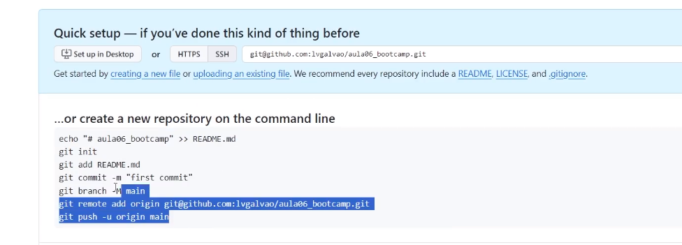
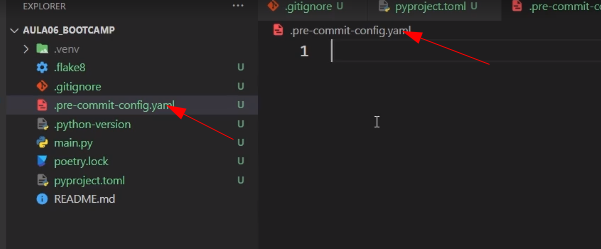

# Como criar um ambiente corretamente

Para começar um projeto, normalmente é uma boa prática iniciar o mesmo utilizando um padrão de convenção de desenvolvimento que é compartilhado e aplicado pela comunidade.

Nesse arquivo, vamos criar um projeto do zero utilizando os seguintes programas:

- Black
- isort
- flake8
- Bandit
- Commitizen

# Iniciando o projeto: criando repositório.

Criar uma pasta. Para essa iniciativa criaremos a pasta "como_criar_ambiente"

```bash
mkdir como_criar_ambiete
```

Acessar o git hub e criar um repositório. Basta apenas dar um nome para o mesmo, selecionar como público e depois clilar e "create repository".


Figura 01 - Criando repositório parte 01.


Figura 02 - Criando repositório parte 02.


Após a criação do repositório no git hub usando o acesso Web, copiar os comandos sugeridos após criação e executar no terminal.



Figura 03 - Copiar comandos e executar na pasta local criada.


Figura 04 - Execução dos comandos no terminal

### Iniciando o uso do novo projeto

Criar um arquivo qualquer do tipo python, apenas como exemplo. Nesse caso, utilizamos o nome como sendo main.py e inserimos como exemplo de código:

One Billion Row Chakkenge-Python

```python
from csv import reader
from collections import defaultdict
import time

from pathlib import Path

def processar_temperaturas(path_do_txt: Path):
    print("Iniciando o processamento do arquivo.")
    start_time = time.time()  # Tempo de início

    temperatura_por_station = defaultdict(list)

    """
        Exemplo de como vai ficar a variável temperatura_por_station
        temperatura_por_station = {
            'Hamburg': [12.0],
            'Bulawayo': [8.9],
            'Palembang': [38.8],
            'St. John\'s': [15.2],
            'Cracow': [12.6],
            'Bridgetown': [26.9],
            'Istanbul': [6.2, 23.0], # Note que Istanbul tem duas entradas
            'Roseau': [34.4],
            'Conakry': [31.2],
        }
        O uso de defaultdict do módulo collections é uma escolha conveniente 
        Sem o defaultdict, o código para adicionar uma temperatura iria parecer com isso:
        if nome_da_station not in temperatura_por_station:
            temperatura_por_station[nome_da_station] = []
        temperatura_por_station[nome_da_station].append(temperatura)
        Com defaultdict, isso é simplificado para:
        temperatura_por_station[nome_da_station].append(temperatura)
    """

    with open(path_do_txt, 'r', encoding="utf-8") as file:
        _reader = reader(file, delimiter=';')
        for row in _reader:
            nome_da_station, temperatura = str(row[0]), float(row[1])
            temperatura_por_station[nome_da_station].append(temperatura)

    print("Dados carregados. Calculando estatísticas...")

    # Dicionário para armazenar os resultados calculados
    results = {}

    # Calculando min, média e max para cada estação
    for station, temperatures in temperatura_por_station.items():
        min_temp = min(temperatures)
        mean_temp = sum(temperatures) / len(temperatures)
        max_temp = max(temperatures)
        results[station] = (min_temp, mean_temp, max_temp)

    print("Estatística calculada. Ordenando...")
    # Ordenando os resultados pelo nome da estação
    sorted_results = dict(sorted(results.items()))

    # Formatando os resultados para exibição
    formatted_results = {station: f"{min_temp:.1f}/{mean_temp:.1f}/{max_temp:.1f}" for station, (min_temp, mean_temp, max_temp) in sorted_results.items()}

    end_time = time.time()  # Tempo de término
    print(f"Processamento concluído em {end_time - start_time:.2f} segundos.")

    return formatted_results

# Substitua "data/measurements10M.txt" pelo caminho correto do seu arquivo
if __name__ == "__main__":

    # 1M 0.38 segundos
    # 10M 3.96 segundos.
    path_do_txt: Path = Path("data/measurements.txt")
    # 100M > 5 minutos.
    resultados = processar_temperaturas(path_do_txt)
```


Após a criação do arquivo python, partindo da ideia que estamos em um projeto, como que seria feito essa avaliação de código ?

Vamos criar o nosso ambiente para fazer essa análise de código como base no PEP8 de modo automático.


Configurar o pyenv local como sendo 3.11.5. Caso não tenha o pyenv instalado, verificar a documentação apropriada para essa configuração.

O comando a seguir vai criar um arquivo no projeto chamado .python-version

```bash
pyenv local 3.11.5
```


Figura 05 - Configurando o pyenv local 3.11.5.

#ATENÇÃO: Caso não possua o pyenv instalado, executar o processo de instalação tendo como base o link abaixo.
Link: https://www.vivaolinux.com.br/dica/Instalando-o-pyenv-no-Linux-Mint-e-Ubuntu

Instalando a versão do python 3.11.5:
```bash
pyenv install -v 3.11.5
```

Validando ser a versão local foi aplicada com sucesso:
```bash
pyenv versions
```


Criar o arquivo poetry init:

Esse comando vai criar um arquivo na pasta do projeto denominada "pyprojeto.toml"

```bash
poetry init
```


Figura 06 - Executando poetry init.

#ATENÇÃO:
###Caso o comando "poetry init" não seja executado com sucesso, efetuar a instalação com base na url abaixo.
Link: https://medium.com/@mronakjain94/comprehensive-guide-to-installing-poetry-on-ubuntu-and-managing-python-projects-949b49ef4f76

Executar o comando poetry env use 3.11.5 para utilizar o pyenv local disponibilizado:

```bash
poetry env use 3.11.5
```


Figura 07 - Usando o pyenv por meio do poetry init.

Executnado poetry shell:

```
poetry shell
```

Comando poetry shell faz vocÇê trabalhar no ambiente dedicado para o python versão 3.11.5 apenas no escopo do projeto.


Figura 08 - Poetry shell.

### Adicionando as bibliotecas

No ambiente shell dedicado para o python 3.11.5, vamos adicionar as bibliotecas.

```
poetry add flake8
```

Flake 8 - Validação do seu código com base nas regras de desenvolvimento estabelecidas na PEP8

Depois do Flake 8 instalado, avaliar o arquivo main para saber se o mesmo possui ajustes a serem feitos.

```
poetry run flake8 main.py
```


Figura 09 - Avaliando arquivo main.py


### Diferença do Flake8 em relação ao Black e o Isort.

Tanto o Flake8 como o Isort e o Black possuem a mesma função de avaliação do código, porém o Isort e o Black fazem essa correção de modo automático.


Adicionar o Black:

```bash
poetry add black
```

Executar o black:

```bash
poetry run black main.py
```


Figura 10 - Black fazendo o ajuste do seu código de modo automático.


### Conflitos de conceito entre o Flake 8 e o Black.

Como resolver a questão dos conceitos entre o Flake 8 e o Black.

Criar um arquivo chamado Flake8 e inserir o seguinte texto:


Figura 11 - Criando o arquivo Flake 8 com as exceções.


Executando o Flake 8 novamente:


Figura 12 - Executando Flake 8.


Configurar o arquivo Flake 8 para que o mesmo possa se adequar junto ao Black:


Figura 13 - Configurando o arquivo Flake 8 para ser compatível com o Black.

Executando tanto o Flake 8 quanto o Black para avaliação do código:


Figura 14 - Executando o Black e o Flake 8 para avaliação de código.

### Adicionando o Isort ao projeto.

O objetivo do Isort é de organizar o código de acordo com uma ordem de digitação do código.

Por exemplo, primeiro vem a importação dos módulos, depois das funções, depois das funções de projeto, etc.

Adicionado o Isort ao projeto:


Figura 15 - Adicionando o isort ao projeto.


Avaliando o arquivo main com o comando Isort:


Figura 16 - Executando o Isort


# Garantindo a avaliação do projeto

Vimos o uso do Flake8, Black e do Isort. Como garantir que todos os três programas sempre serão executados para validação do projeto? Deixar isso a cargo do desenvolvedor pode ser um problema para avaliação.

Existe o conceito de PRE-COMMIT no Git hub, que faz a executação dos comandos em escopo de projeto para avaliar os arquivos que serão submetidos ao commit, para saber se estão seguindo as boas práticas de desenvolvimento.

### Configurando o PRE-COMMIT

Adicionar o arquivo chamado gitignore e inserir o seguinte código:


Figura 17 - Adicionar o arquivo gitignore


### Antes de iniciar o PRE-COMMIT

É necessário editar o arquivo pyproject.toml para não termos conflitos de projeto entre o Black, Flake8 e o Isort.

Eidtar o arquivo:


Figura 18 - Editando o arquivo pyproject.


Eu seguida adicionar a biblioteca taskipy para executar o Flake8, Black e o Isort de uma única vez:


Figura 19 - Adicionando o Taskpy.

Editando o pyproject para avaliar somente o arquivo main.py. IMPORTANTE AQUI PESQUISAR PARA QUE O ARQUIVO .VENV NÂO SEJA AVALIADO.


Figura 20 - Editando o arquivo pyproject para usar o taskpy.


Agora estamos prontos para executar o taskpy com a opção format:


Figura 21 - Taskpy com a opção format.

### Retornando para o PRE-COMMIT


Uma pequena ilustração do conceito de PRE-COMMIT.


Figura 22 - Conceito de PRE-COMMIT

Fazendo a instalação do PRE-COMMIT:


Figura 23 - Instalação do PRE-COMMIT

Arquivo chamado pre-commit-config.yaml criado e que será utilizado como base para executar o PRE-COMMIT:




Figura 24 - Arquivo de PRE-COMMIT criado.


Exemplo de um PRE-COMMIT para ajudar na questão de CYBERSECURITY (bandit).


Figura 25 - PRE-COMMIT para avaliar aspectos de CYBERSECURITY no seu projeto.


Exemplo da primeira parte do pre-commit-config.yaml:


Figura 26 - Arquivo PRE-COMMIT PARTE 01.


Figura 27 - Arquivo PRE-COMMIT PARTE 02.


Após a configuração do arquivo de PRE-COMMIT, precisaremos fazer o PRE-COMMIT install usando o poetry.


Figura 28 - PRE-COMMIT install com o poetry.


Para verificar a pasta oculta do git no seu projeto, acessar a sessão settings to VSCODE:


Figura 29 - VSCODE settings.


Acessar exclude e remover a pasta ./git.


Figura 30 - Esclusão do arquivo para deixar de ser oculto no projeto.

Apos isso, é possível ver a pasta .git no seu projeto, acessar a subpasta chamada hooks, que terá todos os passos a serem avaliados no processo de PRE-COMMIT.


Figura 31 - Pasta .git, acessando hooks e validar o processo de PRE-COMMIT.


# Executando o commit com as validações.

Com a configuração de todos os passos anteriores, é chegada o momento de se fazer o commit usando as validações.

Etapas do commit com o comando ADD, COMMIT e PUSH, utilizando como exemplo o arquivo main.py.


Figura 32 - GIT add com o COMMIT.


Vai apresentar erro, antes precisamos fazer o ADD .pre-commit-config.yaml.


Figura 33 - GIT add PRE-COMMIT yaml file.

Importante validar se o arquivo de pre-commit.yaml possui caracter inválido.


Ao executar o COMMIT add com o arquivo yaml e em seguida com o COMMIT, será possível avaliar o PRE-COMMIT atuando.


Figura 34 - Validação do PRE-COMMIT em execução.

Veja o exemplo de execução de um commit. Foi feita a validação e foi apontado que teve falhas no passo de validação da aplicação chamada BLACK mas que já foi corrigida. 


Figura 35 - Falha e correção do PRE-COMMIT.


Quando temos esse processo de correção automática na fase do PRE-COMMIT, será necessário adicionar o arquivo novamente, usando o comando GIT ADD e executar o COMMIT em seguida.


Figura 36 - GIT add e commit novamente, após correção anter na fase de PRE-COMMIT.


# CONCLUSÃO

Ao fim desse projeto, teremos o nosso projeto do GIT HUB seguindo as boas práticas e com padrão de COMMIT de projetos, utilizando o Flake8, Isort, Black, Bandit e o commitizen.


Figura 36 - Bibliotecas obrigatórios em seu primeiro PRE-COMMIT.


